# 具身智能平台开发需求文档 (PRD) - 数据采集、基础数据与设备管理

## 1. 概述 (Summary)
本项目旨在构建一个专业的具身智能（Embodied AI）机器人数据资产平台，聚焦于解决机器人在复杂物理世界中运动位姿、图像帧、传感器时序等异构数据的规范化采集、高效治理与设备级监控。本需求文档详细规划了“数据采集（Data Collection）”、“基础数据（Base Data）”与“设备管理（Device Management）”三大核心模块的业务逻辑，并设定了 V1.0（基础数采与资产化）、V2.0（自动化质检与规则协同）、V3.0（三维空间孪生与自动标定）三个迭代版本的演进路径。

## 2. 项目相关联系人 (Contacts)
| 姓名 | 角色 | 备注 / 职责说明 |
| :--- | :--- | :--- |
| 张工 | 产品经理 (PM) | 负责平台业务逻辑设计、需求定义与路线规划 |
| 李工 | 前端研发专家 (Frontend) | 负责 Next.js 平台原型搭建、可视化组件与实时渲染开发 |
| 王工 | 具身智能算法专家 (Algorithm) | 负责三维定位、轨迹对齐与 kinematics 机检算法实现 |
| 赵工 | 机器人系统工程师 (Robotics) | 负责硬件自检接口设计、数采自检流分发与 OTA 通信 |

## 3. 业务背景 (Background)
*   **行业背景**：具身智能（Embodied AI）的发展高度依赖高质量的真实世界多模态演示数据（Demonstration Data）。然而，传统数采流程面临“软硬件状态不一致”、“人工质检效率低下”以及“物理资产与虚拟轨迹脱节”三大痛点。
*   **为什么是现在？**：当前双臂大底盘机器人与灵巧手设备类型多样，数采会话（Session）所产生的多路高频传感器数据（如 3D Pose , LIDAR Point Cloud, 高频 RGB MP4）吞吐量大、协议不统一。必须在数据采集的源头实现标准化的机器人资产配置与动态质检自检，以规避下游模型训练“垃圾进，垃圾出（Garbage in, Garbage out）”的尴尬困境。
*   **技术红利**：高性能端侧硬件自检、局域网高精度时钟同步、以及 WebGL 实时轨迹动态渲染技术的发展，使得构建一套“软硬一体、自检闭环”的具身智能管理平台成为可能。

## 4. 业务目标与衡量指标 (Objective & OKRs)
本项目的核心目标是**缩短具身演示数据从采集到入库的审核周期，并提高物理机器人设备的在线运行率**。

### 衡量指标 (SMART OKRs)
*   **O1: 提升具身智能原始采集数据的高效产出与质检治理能力**
    *   **KR 1.1**：通过预检机制（相机、雷达状态自检），将由于硬件断联导致的废弃 Session 比例由目前的 15% 降至 2% 以下。
    *   **KR 1.2**：引入 Kinematics 算法自动质检（速度/加速度/角速度超标与静止豁免检查），将单次 Session 机检审核耗时降低至 3 秒以内（较人工审核提效 90% 以上）。
*   **O2: 实现数据资产与设备管理的深度映射**
    *   **KR 2.1**：在 V2.0 版本中支持机器人设备零配件（关节、夹爪、末端执行器）的可视化拓扑关联，零配件追溯率达到 100%。

## 5. 目标用户与市场细分 (Market Segments)
本平台主要面向具身智能研发企业及高校实验室中的以下关键角色：
1.  **数据采集员 (Collector)**：在实验室或物理场景中操纵机器人/操作架进行演示数据采集。其痛点是硬件连接状态不明、数据上传缓慢、不清楚采集到的数据是否合格。
2.  **质检与标注员 (QA / Reviewer)**：负责对采集到的轨迹包、视频流进行质检评估。其痛点是海量二进制文件无法直接预览，人工一行行看 CSV 效率太低。
3.  **系统管理员/研发科学家 (Admin / PM)**：负责定义项目、设计机器人任务书、维护物体库并监控设备资产大盘。其痛点是多模态数据难以统一版本，设备维修和升级信息脱节。

## 6. 核心价值主张 (Value Propositions)
本平台依托以下三个价值维度，提供优于传统方案的体验：
*   **硬自检，采集不跑空**：数采前提供全设备通道就绪自检（LIDAR、RGB-Cam、校准版），避免采集完毕才发现丢包。
*   **轻量化视频与轨迹对齐**：自动转码 H.264，在网页端无缝预览高画质视频，同时采用轻量化 SVG 抽稀算法实时渲染三维轨迹流与速度变化曲线。
*   **端云协同自动机检**：内置自动 kinematics 机检规则（加速度、静态校准判断等），将“人肉质检”升级为“规则引擎自动质检”。

---

## 7. 解决方案 (Solution)

### 7.1 业务架构与原型关联 (UX/Prototypes)
系统采用模块化布局，具体对应原型中的以下路由页面：
*   **基础数据模块**：[项目管理](/collection/projects)、[物体库](/collection/objects)、[任务配置](/collection/config)、[物体标签](/collection/object-labels)。
*   **设备管理模块**：[设备类型](/collection/device-types)、[设备列表](/collection/devices)。
*   **数据采集模块**：[任务派发](/collection/tasks)、[采集工作台](/collection/collect)、[自检与连接](/collection/collect/connection/[taskId])、[数据监控仪表盘](/collection/collect/data/[taskId])、[数据质检详情](/collection/collect/video/[taskId]/[episodeId])。

### 7.2 核心功能描述 (Key Features)

#### 7.2.1 基础数据模块 (Base Data)
提供具身演示任务的前提条件配置：
*   **项目与物体档案**：支持上传物体高清图片、物理参数（长/宽/高/重/材质），建立三维物体的数字指纹。
*   **自检规则与阈值配置**：定义运动合理性指标，如机器人左/右手臂最大允许线速度、最大允许线加速度、静止判定时间窗口、相对变换标定正向矩阵的默认偏差阈值。

#### 7.2.2 设备管理模块 (Device Management)
实现物理资产向数字化层级的绑定：
*   **机器人关节组件建模**：支持设备类型多级拓扑配置。在 [添加设备部件](file:///Users/zhangxiaozhang/Desktop/具身智能平台原型/AddRobotPart.html) 中支持添加驱动板、摄像头、机械臂肘/肩/腕关节及灵巧夹爪，并关联底层固件版本。
*   **设备状态在线监测**：通过通讯队列和 IP 动态心跳，在前端实时展现机器人的连接状态（Online/Offline）、零配件健康状态及异常诊断日志。

#### 7.2.3 数据采集模块 (Data Collection)
实现演示数据流的全生命周期流转：
*   **数采设备预检**：在 [采集自检页面](/collection/collect/connection/[taskId]) 提供标定板校正度、雷达深度流、左右手相机的三维通道预检，自检 100% 通过后一键激活工作台。
*   **数据多模态实时渲染**：在 [数据仪表盘](/collection/collect/data/[taskId]) 页面，不仅能够直接播放转码后的 H.264 左右相机视频，还可通过抽稀算法，使用前端 SVG/Canvas 实时绘制机器人的空间位移曲线（XYZ 三轴变动）及速度（Velocity）散点图，直观发现断联导致的轨迹畸变。
*   **闭环自动化质检**：由机检引擎直接读取 `quality_report.json`。对轨迹正常但因就绪状态静止的设备自动开启“静止豁免”，质检判定通过后数据自动打标签归档入库。

---

## 7.3 技术设计与数据传输架构 (Technology)
*   **视频转码与静态挂载**：针对原始 `mp4v` 不兼容问题，由后台/脚本调用硬件加速（如 macOS 的 `avconvert`）在上传完毕后瞬间转码为 H.264（avc1），并创建相对软链接挂载到 Web 服务器静态目录下，保证浏览器秒开与快进Seek。
*   **数据抽稀服务**：原始 `merged_trajectory.txt` 可能高达数十万行，前端通过 API 接口进行动态等步长抽稀（Downsample to 200 points），减小网络开销。

## 7.4 关键假设与验证风险 (Assumptions)
1.  **硬件层时钟同步假设**：假设所有端侧相机与主控时钟均通过 PTP（IEEE 1588）或 NTP 进行了严格同步。若不同步，则视频与轨迹在时间轴上将产生漂移。
2.  **转码性能假设**：假设系统环境具备硬件编解码器（如 Apple Matrix/Intel QuickSync/NVIDIA NVENC），能保证数据上传完后极速转码。

---

## 8. 版本迭代规划 (Release Planning)

本规划根据三个模块分版本迭代设计，确保需求分阶段平稳落地：

```mermaid
gantt
    title 具身智能平台版本迭代路线图
    dateFormat X
    axisFormat %d
    
    section 基础数据 (Base Data)
    V1.0 (基础配置与物体库)       :active, 0, 15
    V2.0 (自检模板引擎与任务书)   :15, 35
    V3.0 (CAD/三维模型自动关联)    :35, 55
    
    section 设备管理 (Device Management)
    V1.0 (设备物理资产注册)       :active, 0, 20
    V2.0 (关节零配件拓扑与健康度)  :20, 40
    V3.0 (在线固件OTA与自检推送)   :40, 60
    
    section 数据采集 (Data Collection)
    V1.0 (基础工作台与本地文件API) :active, 0, 25
    V2.0 (自适应视频流与算法质检)   :25, 45
    V3.0 (3D虚拟孪生与雷达对齐)    :45, 65
```

### 8.1 基础数据模块 (Base Data) 需求演进
*   **Version 1.0 (最小可行产品 - MVP)**
    *   【项目管理】支持创建/编辑采集项目（绑定特定的机器人型号和场景说明）。
    *   【基础物体库】实现物体基本参数录入（名称、长/宽/高、重、上传封面图），解决基础的“手抓何物”数据标记需求。
    *   【静态任务配置】支持二级任务标签配置（例如：主标签为“抓取”，二级子标签为“抓取水杯”、“抓取螺丝刀”等），支持按二级标签配置独立的物理规则阈值限制（单次最大速度、加速度配置）。
*   **Version 2.0 (标准版 - Standard)**
    *   【质检模板引擎】支持对不同动作任务定义不同的参数阈值配置（例如：“精细对齐”任务线速度限制 0.2m/s，“抓取运输”任务线速度限制 0.5m/s），摆脱全局硬编码。
    *   【富文本任务书】任务说明（Taskbooks）模块升级，支持步骤富文本、图文配合、甚至绑定自检流程脚本。
*   **Version 3.0 (高级版 - Advanced)**
    *   【三维物体模型关联】支持上传物体的 CAD 文件、三维网格模型（OBJ/PLY），与数据可视化模块无缝打通。
    *   【自动标签链路】基于视觉大模型和物体属性，实现数采包自动添加物体交互动作标签的 pipeline。

### 8.2 设备管理模块 (Device Management) 需求演进
*   **Version 1.0 (最小可行产品 - MVP)**
    *   【设备类型定义】支持机器人设备分类注册（双臂大底盘机器人、单机械臂、外置相机支架、三维激光雷达）。
    *   【设备物理台账】实现设备基本信息的在线管理（设备 IP、序列号、在线时长、当前连接状态）。
    *   【关节与部件定义】实现基础零配件关联，支持添加夹爪、相机并记录其固件号。
*   **Version 2.0 (标准版 - Standard)**
    *   【零配件拓扑健康度】实现可视化硬件拓扑图（主控 -> 左臂/右臂 -> 灵巧夹爪/相机接口）。实时监控硬件参数（电机电流、温度、通讯延迟）。
    *   【设备故障自动预警】传感器数据流丢失（如左相机突然无帧率）或延迟超过 100ms 时，自动生成设备异常日志并报警。
*   **Version 3.0 (高级版 - Advanced)**
    *   【云端标定与推送】提供设备标定参数的云端统一管理，机器人出厂/日常运行产生的标定矩阵可自动推送到客户端。
    *   【固件 OTA 编排】支持对整机零配件或大批量机器人的固件进行一键推送、静默升级与故障回退。

### 8.3 数据采集模块 (Data Collection) 需求演进
*   **Version 1.0 (最小可行产品 - MVP)**
    *   【采集大盘】派发采集任务，并在列表中展示每个 Episode 包的解析状态（已入库、等待解析、已废弃）。
    *   【采集工作台】提供连接自检界面，自检通过后在网页端直接呈现转码后的 H.264 高画质视频，并通过 SVG 实时还原左/右机械臂的时序空间位移。
    *   【人工质检面板】支持加载 check.log 质检明细日志，允许质检员人工标记通过或废弃。
*   **Version 2.0 (标准版 - Standard)**
    *   【自适应实时预览】采集终端 of 视频预览支持 WebRTC 或 HLS 自适应码率，防止在网络环境差时卡死。
    *   【全自动机检算法】引入机检后台，数据上传完毕后立刻在后台多线程调用质检模块（Kinematics 速度跃变检查、Displacement 位移检查、正反向变换偏差检查），并自动生成包含违反点比例的 `quality_report.json`。
    *   【规则豁免逻辑】引入规则豁免机制（如静止手臂判定为就绪标定状态，自动免去加速度越限扣分，标记为正常入库）。
*   **Version 3.0 (高级版 - Advanced)**
    *   【3D 空间三维虚拟孪生】利用前端 Three.js 引擎，直接加载机器人 CAD 模型及雷达 3D 点云，实时动态以 3D 虚拟空间孪生形式复现采集数据，支持 360 度自由旋转视角的质检审查。
    *   【多设备自动时钟同步对齐】支持多设备（如动捕系统、手眼相机、关节力矩传感器）的多源高频异步数据流在毫秒级的自动插值对齐与可视化展现。
